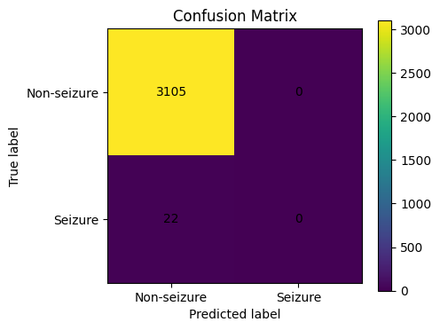
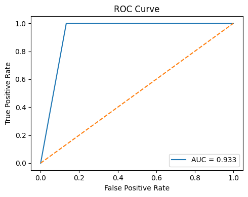
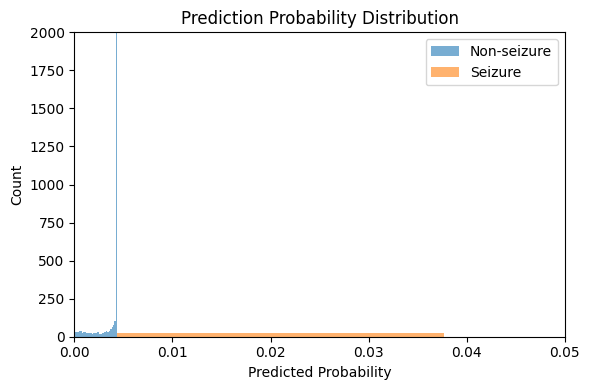

# EEG Seizure Classification

Gefei Zhang  
McGill University  
MAIS 202 
Winter 2026

---

# Motivation

- Epilepsy causes unpredictable seizures  
- EEG analysis is time-consuming  
- Need automatic detection  

---

# Dataset

**CHB-MIT EEG Dataset**

- 22 pediatric subjects  
- 182 annotated seizures  
- Long-term recordings  

- EEG waveform recording from pediatric subject showed 18 channels of brain electrical activity over approximately one hour of continuous monitoring with multiple electrode locations labeled on left axis and time progression in seconds on bottom axis

- Multi-channel EEG recording displayed neural activity patterns across 18 electrode placements from frontal and temporal regions showing brain waves with varying amplitudes across multiple hours of patient monitoring in clinical setting

---

---

---

# Problem

Binary classification:

- Seizure (1)
- Non-seizure (0)

Segment-level classification

---

# Preprocessing

- Bandpass: 0.5–25 Hz
- 18 channels  
- 2-second windows  

---

# Model

## Training set: 
### 3 seizure files 
- "chb01_01.edf"
- "chb01_05.edf"
- "chb01_17.edf"
### 3 non-seizure files 
- "chb01_04.edf"
- "chb01_15.edf"
- "chb01_16.edf"

## Testing set: 
###  1 seizure file 
- "chb01_03.edf"
### 1 non-seizure file 
- "chb01_20.edf"

---

# Results

The confusion matrix clearly shows that the model predicts all samples as non-seizure. While it achieves a high number of true negatives, it completely fails to detect seizure events, which highlights a major limitation of the model.

---

- ROC-AUC ≈ 0.93  
- Model can separate classes 

The ROC curve shows that the model has strong discriminative ability (AUC ≈ 0.95), indicating that it can separate seizure and non-seizure samples probabilistically. However, the default classification threshold prevents it from correctly identifying seizure events.

---

The probability distribution shows that seizure samples tend to have higher predicted probabilities than non-seizure samples, but most values remain below the default threshold of 0.5. This explains why the model fails to classify seizure events despite achieving a high ROC-AUC.

---

# Reference

Guttag, J. (2010). CHB-MIT Scalp EEG Database (version 1.0.0). PhysioNet. RRID:SCR_007345. https://doi.org/10.13026/C2K01R